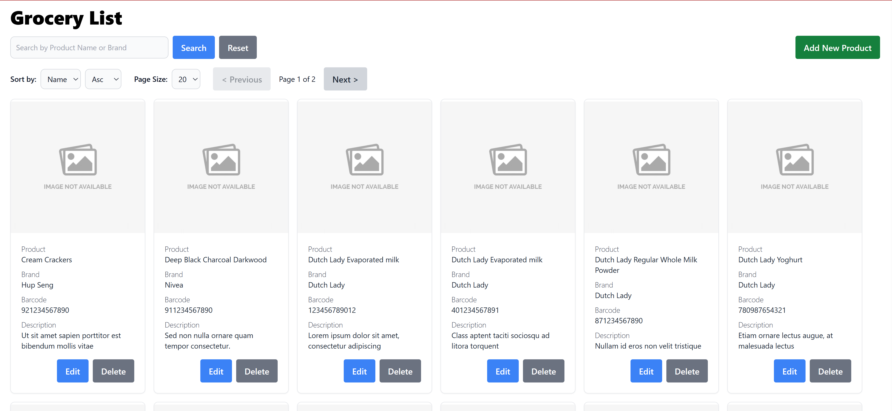

# Getting Started with Groceries

This project was bootstrapped with [Create React App](https://github.com/facebook/create-react-app).

## Prerequisites

Please run backend before proceed. You may visit this [repo](https://github.com/kamilmatnoor/groceries-api) to start.

## Available Scripts

In the project directory, you may follow this:

#### Steps
* `git clone https://github.com/kamilmatnoor/groceries-web.git`
* `cd groceries-web`
* `npm install`
* `npm start`

Runs the app in the development mode.\
Check the console to know you running port.\
You may access the app through your browser by given url eg. `http://localhost:3000`.\

The page will reload when you make changes.\
You may also see any lint errors in the console.

## Live Demo

[Click here](https://groceries-frontend-de1a392ddce5.herokuapp.com/) to see the demo

## Sample Screenshots

 

### Groceries page to display list of producs

  

 

### Groceries page to display data after searching

  

 

### Groceries page to display data after sorting

  

 

### New Product page

  

 

### Validation for empty field during Add & Update operation

  

 

### Validation Barcode length during Add & Update operation

  

 

### Confirmation action message before Update & Delete operation

  

 

### Success message after Add, Update, Delete operation

  

